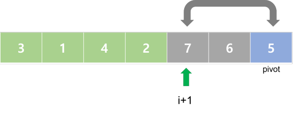

# 퀵 정렬 (Quick sort)

- 분할 정복을 통해 리스트를 정렬
- 정렬 과정
  - 리스트 가운데서 하나의 원소를 고름, 이것을 `피벗(pivot)`이라고 함.
  - 피벗을 기준으로 앞 쪽에는 작은 원소들만, 뒤 쪽에는 큰 원소들만 오도록 함.
  - 피벗을 기준으로 나누어진 두 개의 리스트(피벗보다 작은 원소들 리스트, 큰 원소들 리스트)에 대해 재귀적으로 반복.
  - **피벗의 정확한 위치**를 잡아가면서 정렬해감.
- 평균 시간 복잡도 : O(NlogN)
- 최악 시간 복잡도 : O(N^2)
- 평균적으로는 가장 빠름. (그래서 퀵 정렬인가봄.)
- O(logN)만큼의 메모리가 필요함.
- 같은 값들이 정렬 이후 순서가 달라지는 불안정 정렬.


## 코드

```python
def quick_sort(arr):
    if len(arr) <= 1:
        return arr
    
    # 피벗을 중간 원소로 잡는 경우
    pivot = arr[len(arr) // 2]
    less = []
    more = []
    equal = []
    for x in arr:
        if x < pivot:
            less.append(x)
        elif x > pivot:
            more.append(x)
        else:
            equal.append(x)
            
    return quick_sort(less) + equal + quick_sort(more)
```

```python
# 좀 더 파이썬답게
def quick_sort(arr):
    if len(arr) <= 1:
        return arr
    
    # 피벗을 처음 원소로 잡는 경우
    pivot = arr[0]
    new_arr = arr[1:]
    
    less = [x for x in new_arr if x < pivot]
    more = [x for x in new_arr if x > pivot]
    equal = [x for x in new_arr if x == pivot]
            
    return quick_sort(less) + equal + quick_sort(more)
```


<br/>


### 메모리 개선

`less`와 `more` 리스트 저장을 위해 저장공간을 따로 마련해야함.

배열 내부에서 분할 작업으로 메모리를 개선할 수 있다.

[https://ko.wikipedia.org/wiki/퀵_정렬#파이썬](https://ko.wikipedia.org/wiki/%ED%80%B5_%EC%A0%95%EB%A0%AC#%ED%8C%8C%EC%9D%B4%EC%8D%AC) 참고함.

```python
# 피벗을 기준을 내부에서 분할
def partition(arr, start, end):
    pivot = arr[start]
    left = start + 1
    right = end
    done = False
    while not done:
        # 피벗을 제외한 나머지에 대해 피벗값을 기준으로
        # 작은건 왼쪽으로, 큰 건 오른쪽으로 몰아넣음.
        
        # 피벗보다 작은 값 중 가장 오른쪽에 있는 인덱스를 찾음
        while left <= right and arr[left] <= pivot:
            left += 1
        # 피벗보다 큰 값 중 가장 왼쪽에 있는 인덱스를 찾음
        while left <= right and pivot <= arr[right]:
            right -= 1
        
        # 종료 조건
        if right < left:
            done = True
            
        # left. right swap
        else:
            arr[left], arr[right] = arr[right], arr[left]
    
    # 현재 right는 피벗보다 작은 값 중 가장 오른쪽, 즉 분할된 기준점
    # 피벗을 분할된 기준점으로 이동시킴
    arr[start], arr[right] = arr[right], arr[start]
    
    # 피벗의 인덱스를 반환
    return right

def quick_sort(arr, start, end):
    if start < end:
        pivot = partition(arr, start, end)
        quick_sort(arr, start, pivot - 1)
        quick_sort(arr, pivot + 1, end)
    return arr
```


### Hoare-Partition 알고리즘

```
partition(A[], l, r)
	p = A[l]  // p : 피봇 값
	i = l, j = r
	WHILE i <= j
		WHILE i <= j and A[i] <= p : i++
		WHILE i <= j and A[j] >= p : j--
		IF i < j : swap(A[i], A[j])
	swap(A[l], A[j])
	RETURN j
```

- 아이디어

  - 피봇 값들보다 큰 값은 오른쪽, 작은 값은 왼쪽에 위치하도록함

  - 피봇을 두 집합의 가운데에 위치시킴.

  - i는 왼쪽부터 시작해서 P보다 큰 값을 찾음.

    j는 오른쪽부터 시작해서 P보다 작은 값을 찾음.

  - 그 두 값의 위치를 바꿈.

  - i와 j가 교차하게 되면, i와 j 사이가 피봇을 기준으로 하는 작은 값과 큰 값의 경계하는 뜻.

  - 따라서 j와 피봇의 위치를 바꾸면서 경계에 피봇이 위치하도록함.


### Lomuto partition 알고리즘

```
partition(A[],p, r)
	x = A[r]
	i = p - 1
	
	FOR j in p -> r-1
		IF A[j] <= x
			i++, swap(A[i], A[j])
    
    swap(A[i+1], A[r])
    RETURN i + 1
```

- 아이디어

  - i와 j 사이에 P보다 큰 원소가 위치하게 됨.

  - i : 피봇보다 작은 원소중 가장 오른쪽을 가리킴.

  - j를 하나씩 키워가면서 피봇보다 작은 원소가 나오게 되면 현재 i를 1키우고 

    i와 j에 위치한 원소를 교환한다.





