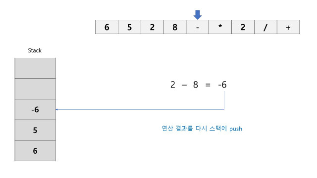

# 후위 표기법

- 중위 표기법
  - 우리가 사용하는 표기법
  - 연산자를 피연산자 가운데에 표시
  - A+B
- 후위 표기법
  - 연산자를 피연산자 뒤에 표시
  - AB+


## 중위 표기법 -> 후위 표기법 변환

- 문자열로 주어진 수식을 계산하기 위해선 후위 표기법으로 바꿔 계산하는 것이 편하다.
- 스택을 이용하여 후위 표기법으로 변환할 수 있다.

- `( 6 + 5 * ( 2 - 8 ) / 2)` => `6 5 2 8 - * 2 / +`

### 방법

1. 입력 받은 중위 표기식에서 토큰을 읽는다.
2. 토큰이 피연산자면 토큰을 출력한다.
3. 토큰이 연산자인 경우, 스택의 top과 우선순위를 비교한다.
   - 우선순위
     - token 우선순위
       - `(` = 3
       - `*, / ` = 2
       - `+, - ` = 1
     - stack 우선순위
       - `(` = 0
       - `*, / ` = 2
       - `+, - ` = 1
   - 스택이 비거나, 토큰이 스택의 top보다 우선순위가 높을 때까지 스택에서 pop해서 출력한다.
   - 토큰이 스택의 top보다 우선순위가 높다면 스택에 토큰을 push한다.
   - 연산자가 만약 `)`라면 `(`가 나올 때까지 스택에서 pop해서 출력한다.
4. 중위 표기식을 다 읽었다면 스택에 남아있는 것들을 pop해서 출력한다.


### 코드

```python
def postfix_notation(formula):
    stack = []
    result = ''
    for token in formula:
        if token in token_rank:
            # 닫는 괄호가 아니면 stack이 비거나
            # stack의 top보다 우선순위가 높아질 때까지 pop
            if token != ')':
                while stack and stack_rank[stack[-1]] >= token_rank[token]:
                    temp = stack.pop()

                    # 괄호면 추가하지 않아도 됨
                    if temp != '(' and temp != ')':
                        result += temp

                # stack에 push
                stack.append(token)

            else:
                # 닫는 괄호 일 때는 
                # 열린 괄호가 나올 때까지 pop
                while stack:
                    temp = stack.pop()
                    if temp == '(':
                        break

                    result += temp

        # 피연산자면 result에 추가
        else:
            result += token

    # stack에 남은 것들 result에 추가
    while stack:
        temp = stack.pop()
        if temp != '(' and temp != ')':
            result += temp

    return result
```


### 그림으로 살펴보기

- `( 6 + 5 * ( 2 - 8 ) / 2)` => `6 5 2 8 - * 2 / +` 변환 과정


## 후위 표기식 계산

- 이제 후위 표기식을 계산하자.
- 계산도 스택을 이용할 수 있다.


### 방법

- 후위 표기식에서 토큰을 읽는다.
- 토큰이 피연산자면 스택에 push한다.
- 토큰이 연산자면 스택에서 두 개를 pop해서 연산 후 연산 결과를 스택에 push한다.
- 후위 표기식을 다 읽었다면 stack에 남아있는 결과값을 출력한다.


### 코드

```python
def calculate_formula(formula):
    # 후위 표기법 계산하기
    stack = []
    for token in formula:
        # 연산자면 stack에서 두 개를 꺼내서 연산 후
        # 다시 stack에 push
        if token in operator:
            a = int(stack.pop())
            b = int(stack.pop())
            if token == '+':
                stack.append(b + a)
            elif token == '*':
                stack.append(b * a)
            elif token == '-':
                stack.append(b - a)
            elif token == '/':
                stack.append(b // a)  # /가 몫을 계산하는 경우

        # 피연산자면 stack에 push
        else:
            stack.append(token)

    # 최종 결과
    return stack.pop()
```


### 그림으로 살펴보기





## BOJ :doughnut:

[BOJ 1918 - 후위 표기식](https://www.acmicpc.net/problem/1918)

