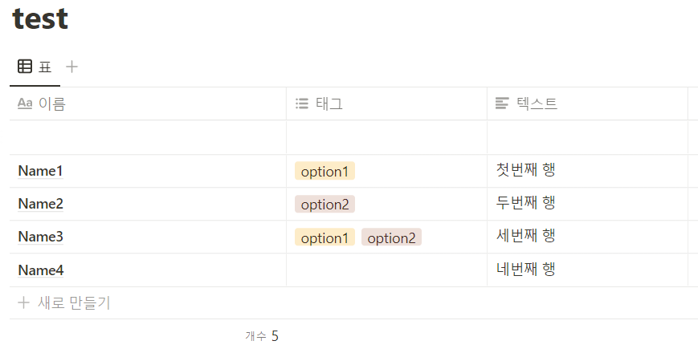
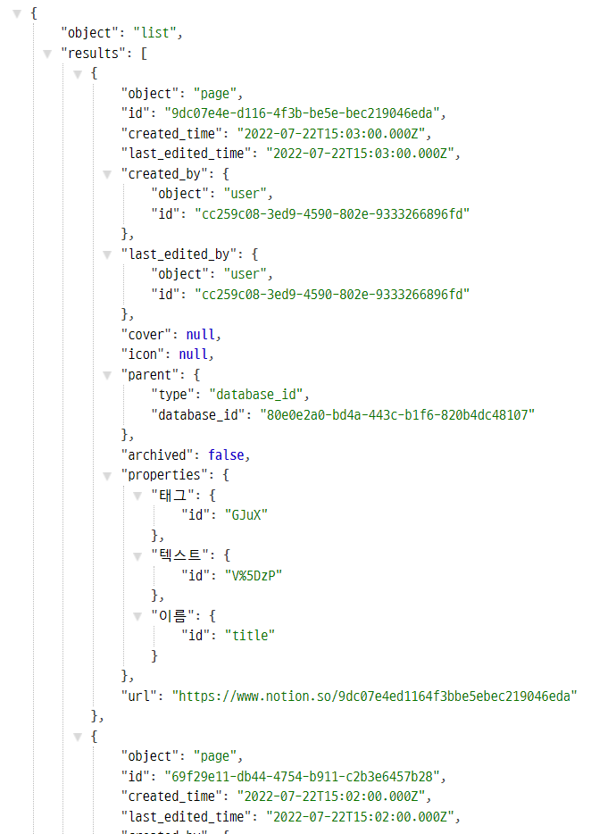
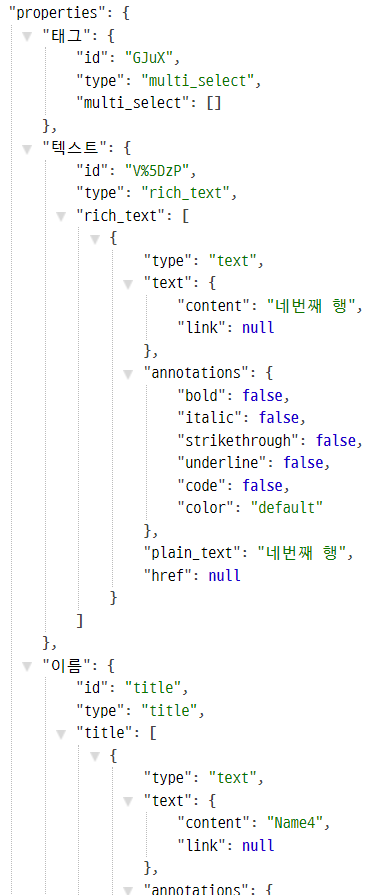
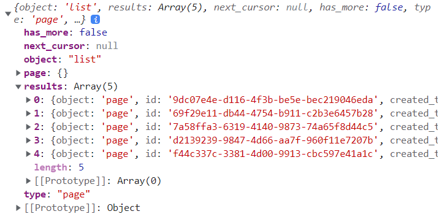

# Cloudflare Worker + Notion API

React 앱에서 내 노션 DB에 작성한 데이터를 불러오기 위해 Cloudflare Worker를 이용해볼거다.

## Notion API

우선 https://www.notion.so/my-integrations 에 들어가서 **API키**를 받는다.

그리고 노션에 DB를 하나 만든다.




그리고 화면 오른쪽 위의 공유 버튼을 누르고 방금 만든 API에 연결한다.

노션 API를 이용하기 위해서는 API키와 Database ID가 필요한데 Database ID는 주소창에 있다.

> `https://www.notion.so/<Database_ID>?v=<<...>>`
>
> 이렇게 생긴  부분이 DB ID다.


## Cloudflare Worker 코드 작성

이제 노션을 위한 Cloudflare Worker를 만들자. 저번에 해본대로 프로젝트 파일을 열고 아래를 입력하자.

```bash
$ wrangler init my-notion-worker
```

`my-notion-worker`라는 이름의 Worker를 만들었다.


`wrangler.toml` 파일에 노션 API KEY와 Database ID를 저장한다.

```
NOTION_API_KEY = "secret_..."
DATABASE_ID = "<DATABASE_ID>"
```


이제 `index.ts` 파일을 수정하자. fetch가 들어오면 노션 API로 Query Database 요청을 보내고, 그 응답 결과를 응답하는 코드를 작성하자.

https://developers.notion.com/reference/post-database-query를 참고해서 url, method, headers를 작성하자.

React앱에서 결과를 받을 때 CORS 에러를 피하기 위해 `"Access-Control-Allow-Origin": "*"`도 써준다.

```typescript
const url = `https://api.notion.com/v1/databases/${DATABASE_ID}/query`;
async function gatherResponse(response: Response) {
  return JSON.stringify(await response.json());
}

async function handleRequest() {
  const init = {
    method: "POST",
    headers: {
      Authorization: `Bearer ${NOTION_API_KEY}`,
      "Notion-Version": "2022-06-28",
      "content-type": "application/json;charset=UTF-8",
      "Access-Control-Allow-Origin": "*",
    },
  };
  const response = await fetch(url, init);
  const results = await gatherResponse(response);
  return new Response(results, init);
}

addEventListener("fetch", (event) => {
  return event.respondWith(handleRequest());
});
```


코드를 모두 작성한 뒤 publish 해준다.

```bash
$ wrangler publish
```


확인을 위해 `https://my-notion-worker.<MY_NAME>.workers.dev/`로 들어가보자.



데이터를 살펴보면 노션 테이블의 각 행이 page객체로 넘어온다.

여기서 문제가 생겼다. page 객체에 properties에 id까지만 담기고, 더 자세한 type이나 실제 내용은 담기지 않는다.

다른 코드들을 참고했을 때는 모두 담겨져 있는 것을 봐서 Notion API 버전 차이인 것 같다.

https://developers.notion.com/changelog/releasing-notion-version-2022-06-28 를 읽어보면

> With version `2022-06-28`, the `type` and `property` value from page objects are removed. Thus moving forward, all property value retrieval must happen through the retrieve a page property item endpoint.

`2022-06-28` 버전부터는 page 객체에 `type` , `property` 값이 빠진다고 한다.

그래서 모든 property value 조회는 page property item 조회 엔드포인트를 통해 진행해야한다고 한다.

이번엔 간단한 DB를 사용해볼 것이기 때문에 Notion API 버전을 `2022-02-22`로 수정해서 해결했다.

```typescript
"Notion-Version": "2022-02-22",
```

그리고 다시 확인해보면 이제 properties에 더 자세한 정보가 담긴걸 확인할 수 있다.



## React 코드 작성

React 앱에 API 요청을 위한 파일을 작성해주자.

```react
// api.ts

export const queryDatabase = async () => {
  return await fetch("https://my-notion-worker.<MY_NAME>.workers.dev/");
};
```


그리고 데이터를 불러올 컴포넌트에서 `queryDatabase`를 이용해 데이터를 불러오자.

```react
function App() {
  useEffect(() => {
    queryDatabase()
      .then((res: Response) => res.json())
      .then((data) => console.log(data))
  })
  return <div>App</div>
}
```

브라우저 콘솔 창을 열어보면 아래와 같이 데이터를 잘 받아오는 걸 확인할 수 있다.



이제 이 데이터를 예쁘게 꾸밀 일만 남았다.