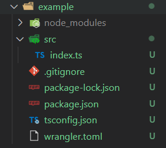
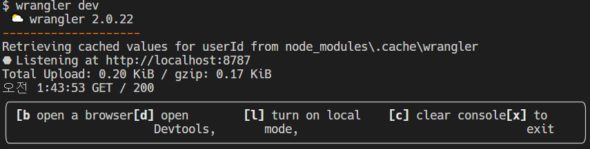
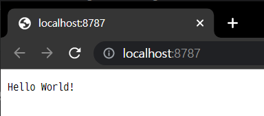
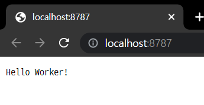
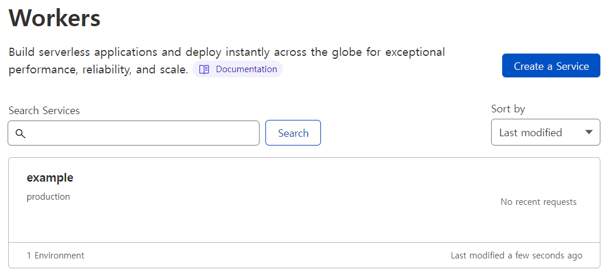
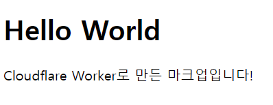
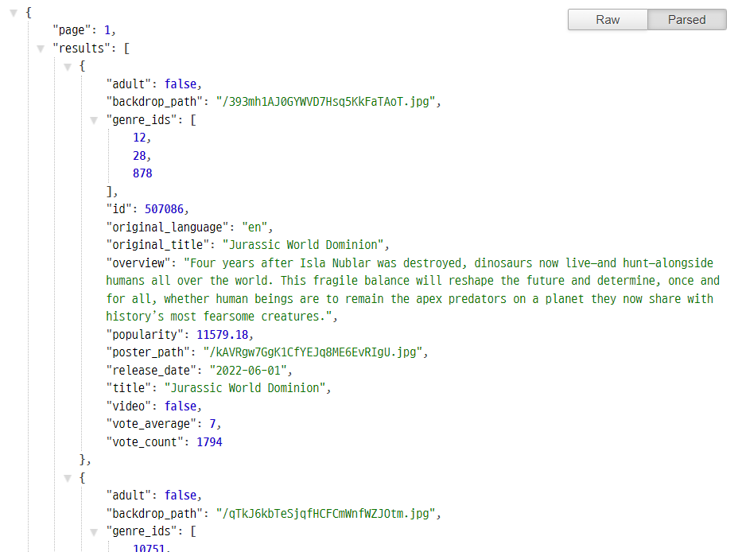

# Cloudflare Workers 체험기

> https://workers.cloudflare.com/

서버리스 API를 만들어보기 위해 Cloudflare Workers를 써보기로 했다!

```
You write code.
We handle the rest.

듬직하다.
```


메인 페이지에 써있는 장점을 읽어보면

- 빠르게 배포

- 성능, 안정성, 확장성

- 자동 스케일링

- 전세계 네트워크에서 성능 좋음

- JS, Rust, C, C++

- Cold start 없음

- 저렴

  ...

많다!

## 시작하기

> https://developers.cloudflare.com/workers/get-started/guide/

```bash
$ npm install -g wrangler
```

`wrangler` 라는 Workers command-line interface를 설치한다.


```bash
$ wrangler login
```

명령어를 입력하면 웹페이지가 열리고 로그인을 할 수 있다.

하단의 Allow 버튼을 눌러서 진행할 수 있다.


프로젝트 파일을 하나 만들고 프로젝트를 생성했다.

```bash
$ wrangler init <YOUR_WORKER>
```

4개 정도를 `(y/n)`으로 물어봤는데 전부 `y`를 입력해줬다. 아래 사진과 같이 프로젝트가 만들어진다.




`index.ts` 파일 안에는 아래 코드가 담겨있다.

```typescript
// index.ts

export default {
	async fetch(
		request: Request,
		env: Env,
		ctx: ExecutionContext
	): Promise<Response> {
		return new Response("Hello World!");
	},
};
```


```bash
$ wrangler dev
```

위 명령어를 입력하면 로컬 서버가 실행된다.






Hello World! 가 나온다.


`index.ts`의 `Response("Hello World!")` 를 `Response("Hello Worker!")`로 바꿔보자.

브라우저를 새로고침하면 바뀐 걸 확인할 수 있다.




이 Worker를 publish할 수 있다.

```bash
$ wrangler publish
```




## Example 1 (Return small HTML page)

Worker를 이용해 간단한 HTML page를 보내보자

`index.ts`의 내용을 아래와 같이 수정하자

```typescript
// index.ts

const html = `<!DOCTYPE html>
<body>
  <h1>Hello World</h1>
  <p>Cloudflare Worker로 만든 마크업입니다!</p>
</body>
`;

async function handleRequest(request: Request) {
  return new Response(html, {
    headers: {
      "content-type": "text/html;charset=UTF-8",
    },
  });
}

addEventListener("fetch", (event) => {
  return event.respondWith(handleRequest(event.request));
});
```

그리고 다시 publish하자

```bash
$ wrangler publish
```

publish된 후에 subdomain(`<내 WORKER>.<내 SUBDOMAIN>.workers.dev`)에 가보면 html이 나오는 걸 확인할 수 있다!




## Example 2 (Fetch JSON)

외부 API에 GET요청을 보내서 JSON을 얻어오자!

TMDB에서 최근 인기 영화 정보를 가져오자.


TMDB에 요청을 보내려면 API Key가 필요하다. 먼저 API Key를 준비하자.

회원가입을 하고 설정 > API > API 키에서 확인할 수 있다.


`wrangler.toml` 파일에 API KEY를 저장하자.

[vars] 바로 아래에 `키 = 값` 형태로 적어주면 된다.

```
[vars]
TMDB_API_KEY = "<API Key>"
```

내 API KEY는 비밀이기 때문에 터미널 창에서 비밀 입력도 해준다.

```bash
$ wrangler secret put TMDB_API_KEY
```


요청을 받으면, TMDB API에서 popular 영화들을 fetch해오는 코드를 `index.ts`에 작성해주자.

```typescript
// index.ts
import * as dotenv from "dotenv";
dotenv.config();

const API_KEY = process.env.API_KEY;

const host = "https://api.themoviedb.org/3/movie";
const url = host + "/popular";

async function gatherResponse(response: Response) {
  return JSON.stringify(await response.json());
}

async function handleRequest() {
  const init = {
    headers: {
      "content-type": "application/json;charset=UTF-8",
    },
  };
  const response = await fetch(url + `?api_key=${TMDB_API_KEY}`, init);
  const results = await gatherResponse(response);
  return new Response(results, init);
}

addEventListener("fetch", (event) => {
  return event.respondWith(handleRequest());
});
```

> TMDB_API_KEY 에 빨간 줄은 뜨지만 문제없는 것 같다!


그리고 다시 publish하자

```bash
$ wrangler publish
```

publish된 후에 subdomain(`<내 WORKER>.<내 SUBDOMAIN>.workers.dev`)에 가보면 JSON이 나오는 걸 확인할 수 있다!

