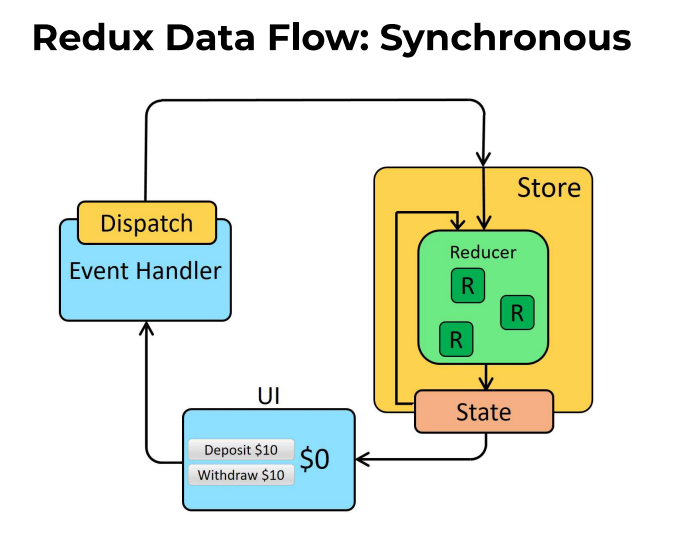
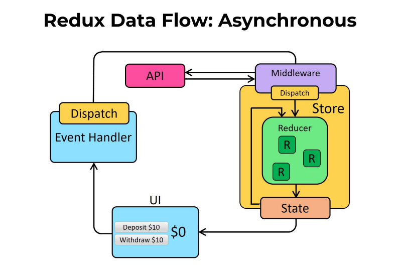

# 상태관리 라이브러리 (Redux)

## Redux

- 자바스크립트 앱을 위한 예측 가능한 상태 컨테이너
  - 일관적으로 동작, 서로 다른 환경에서 작동, 테스트하기 쉬운 앱을 작성
  - 시간여행형 디버거와 결합된 실시간 코드 수정 같은 훌륭한 개발자 경험 제공
- 리액트 생태계에서 가장 사용률이 높은 상태 관리 라이브러리
- 예측 가능
  - 업데이트 발생의 방법과 시기를 제한에 상태 변화를 예측 가능하도록 만듦
  - 세 가지 원칙
    - Single source of truth : 앱의 상태는 하나의 store에 저장
    - state는 Read-only : 상태는 액션으로 변경, 다른 방법으로 상태 직접 변경 불가
    - 변화는 순수 함수로 : 상태 변화는 순수 함수인 리듀서에 의해서 이루어짐
- 중앙화
  - 하나의 스토어와 하나의 상태 트리를 가짐으로써 강력한 기능들이 가능해짐
    - 모든 업데이트 기록
    - API 조작
    - undo/redo
    - 상태 지속
    - “시간여행 디버깅”
- 리덕스 기본 동작
  - 앱의 상태가 하나의 저장소(store)에 있는 객체 트리에 저장
  - 액션(action) : 상태 트리를 변경하는 유일한 방법, 객체
  - 리듀서(Reducer) : 액션이 상태 트리를 어떻게 변경할지 명시

## Redux vs ContextAPI

### 1. 미들웨어

- 리덕스에서는 리듀서 함수를 사용. 리덕스의 미들웨어를 사용하면 액션 객체가 리듀서에서 처리되기 전에 원하는 작업을 수행할 수 있음
  - 특정 조건에 따라 액션 무시
  - 액션을 콘솔에 출력, 서버에 로깅
  - 디스패치 시 수정해서 리듀서에 전달
  - 특정 액션 발생 시 다른 액션 발생
  - 특정 액션 발생 시 특정 함수 실행
- 비동기 작업 처리시 유용

### 2. 유용한 함수와 Hook

- connect 함수를 사용하면 리덕스의 상태 또는 액션 생성 함수를 컴포넌트의 props로 받아올 수 있음.
- useSelector, useDispatch, useStore과 같은 Hook을 사용해 손쉽게 상태 조회, 액션 디스패치 가능
- connect, useSelector 함수에는 최적화가 되어있어, 실제 상태 변경 시에만 리렌더링. 반면 Context API는 Context의 Provider 내부 컴포넌트들이 모두 리렌더링.

### 3. 하나의 커다란 상태

- 리덕스는 모든 글로벌 상태를 하나의 커다란 상태 객체에 넣어서 사용

## 리덕스가 필요한 경우

1. 프로젝트의 규모가 큰가?
2. 비동기 작업이 자주 있는가?

## 키워드

### 1. 액션(Action)

- 상태에 변화가 필요하면 액션을 발생시킴
- 액션은 하나의 객체
- type 필드 필수적

### 2. 액션 생성함수(Action Creator)

- 액션을 만드는 함수, 파라미터를 받아와 액션 객체 형태로 만듦
- 나중에 컴포넌트에서 더욱 쉽게 액션을 발생시키기 위함. 보통 export 키워드로 다른 파일에서 불러와서 사용

### 3. 리듀서(Reducer)

- 상태 변화 로직을 담은 함수
- 순수 함수로 부수 효과가 없어야 함
- immutably 하게 데이터를 업데이트 해야함. - 입력값의 복사본을 만들어 복사본을 수정하고 반환
- 변화를 일으키는 함수. 두 가지 파라미터
  - state, action
- 현재의 상태와 전달받은 액션 참고해 새로운 상태를 만들어서 반환

### 4. 스토어(Store)

- 현재 상태 값을 저장, createStore 메서드로 생성
- 메서드
  - dispatch : 전달받은 액션 객체로 상태 업데이트
  - getState : 현재 저장된 상태값 반환
  - subscribe : 콜백 함수를 받아 액션 디스패치마다 실행
- 한 애플리케이션 당 하나의 스토어
- 현재 앱 상태, 리듀서, 내장 함수가 들어있음

### 5. 디스패치(dispatch)

- 스토어 내장 함수
- 액션을 발생시키는 것
- dispatch 함수에 액션을 파라미터로 전달 ⇒ 스토어는 리듀서 함수를 실행시켜 해당 액션을 처리하는 로직이 있으면 액션을 참고해 새로운 상태를 만들어냄

### 6. 구독(subscribe)

- 스토어 내장 함수
- subscribe 함수는 함수 형태의 값을 파라미터로 전달 ⇒ 액션 디스패치 될 때마다 전달한 함수 호출






### 미들웨어

- 미들웨어 : dispatch를 감싸는 스토어 플러그인
- 비동기 로직에 주로 사용
- Redux thunk 미들웨어 : 표준 비동기 미들웨어
  - dispatch에 액션 대신 함수를 넘길 수 있도록 함
  - 해당 함수는 `(dispatch, getState)` 를 인자로 받음

## 리덕스 3가지 규칙

### 1. 하나의 애플리케이션에는 하나의 스토어

- 여러 개의 스토어가 사용 가능하지만 권장되지 않음.

### 2. 상태는 읽기 전용

- 불변성을 유지해야함.
- 내부적으로 데이터 변경 감지에 shallow equality 검사, 객체 깊숙히는 비교하지 않아 성능이 좋음

### 3. 리듀서는 순수 함수

- 리듀서 함수는 이전 상태와 액션 객체를 파라미터로 받음
- 이전 상태는 건들이지 않고, 변화를 일으킨 새로운 상태 객체 만들어서 반환
- 똑같은 파라미터로 호출된 리듀서 함수는 언제나 똑같은 결과값 반환

## 리덕스 적용

- Ducks 패턴
  - https://github.com/JisuPark/ducks-modular-redux
  - 액션과 리듀서를 같은 파일에 몰아넣어 작성하는 방식

1. createStore로 스토어 만들기

   ```jsx
   // src/index.js
   
   import { createStore } from "redux";
   const store = createStore(rootReducer);
   ```

2. 리덕스에서 관리할 상태를 정의

   ```jsx
   // modules/counter.js
   
   const initialState = {
     number: 0,
     diff: 1,
   };
   ```

3. 액션 타입을 정의

   1. ‘my-app/ACTION_NAME 식으로 작성, 다른 모듈과 액션 이름 중복 방지

   ```jsx
   // modules/counter.js
   
   const SET_DIFF = "counter/SET_DIFF";
   const INCREASE = "counter/INCREASE";
   const DECREASE = "counter/DECREASE";
   ```

4. 액션 생성 함수를 정의

   1. 생성함수는 export 키워드로 내보내기

   ```jsx
   // modules/counter.js
   
   const SET_DIFF = "counter/SET_DIFF";
   const INCREASE = "counter/INCREASE";
   const DECREASE = "counter/DECREASE";
   
   export const setDiff = (diff) => ({ type: SET_DIFF, diff });
   export const increase = () => ({ type: INCREASE });
   export const decrease = () => ({ type: DECREASE });
   ```

5. 리듀서 선언

   1. 리듀서는 export default로 내보내기

   ```jsx
   // modules/counter.js
   
   ...
   
   export default function counter(state = initialState, action) {
     switch (action.type) {
       case SET_DIFF:
         return {
           ...state,
           diff: action.diff,
         };
       case INCREASE:
         return {
           ...state,
           number: state.number + state.diff,
         };
       case DECREASE:
         return {
           ...state,
           number: state.number - state.diff,
         };
   
       default:
         return state;
     }
   }
   ```

6. 루트 리듀서로 모듈 합치기

   1. modules/index.js에 combineReducers 사용

   ```jsx
   // modules/index.js
   
   import { combineReducers } from "redux";
   import counter from "./counter";
   import todos from "./todos";
   
   const rootReducer = combineReducers({
     counter,
     todos,
   });
   
   export default rootReducer;
   ```

7. App 컴포넌트에 Provider store={store} 적용

   ```jsx
   // src/index.js
   
   import { Provider } from "react-redux";
   const root = ReactDOM.createRoot(document.getElementById("root"));
   root.render(
     <Provider store={store}>
       <App />
     </Provider>
   );
   ```

## 프리젠테이셔널 컴포넌트와 컨테이너 컴포넌트

- 리덕스의 창시자 Dan Abramov가 소개한 패턴
- 프리젠테이셔널 컴포넌트
  - 리덕스 스토어에 직접 접근하지 않고 필요한 값 또는 함수를 props로만 받아와서 사용하는 컴포넌트
  - 어떻게 보이는가(UI 선언)에 집중
  - 액션이나 스토어 같은 다른 애플리케이션 부분에 의존하지 않음
  - 데이터가 어떻게 로드되고 변화되는지 상관하지 않음
  - props만을 통해 데이터와 콜백 전달받음
- 컨테이너 컴포넌트
  - 리덕스 스토어의 상태를 조회하거나 액션을 디스패치 할 수 있는 컴포넌트
  - 어떻게 동작하는가에 집중
  - 프리젠테이셔널 컴포넌트 또는 다른 컨테이너 컴포넌트에 데이터와 행동 전달
  - 보통 HOC로 생성됨
- 패턴의 장점
  - 관심사 분리
  - 재사용성
  - 프리젠테이셔널 컴포넌트는 “팔레트”, 로직의 변경없이 디자인 수정 가능
  - 레이아웃 컴포넌트를 추출하도록 하고, 같은 마크업을 복제하는 대신 this.props.children을 사용하게 끔 유도

## React Redux

- 공식 Redux UI binding layer
- React 컴포넌트에서 Redux 스토어 데이터를 읽고, 액션 디스패치 가능

### 왜 React Redux인가

- Redux와 다른 UI layer를 함께 사용하는 방법
  1. Redux 스토어 만들기
  2. 업데이트 subsribe하기
  3. subscription 콜백 안에
     1. 현재 스토어 상태 가져오기
     2. 현재 UI 조각에서 필요한 데이터 추출
     3. 데이터로 UI 업데이트
  4. 필요하다면 초기 상태로 UI 렌더
  5. UI 입력에 Redux 액션 디스패치로 응답
- 위 과정을 일일이 작성하기 힘들 수 있음.
- UI 성능 최적화가 복잡할 수 있음
- React Redux같은 UI binding 라이브러리가 스토어 상호작용 로직을 다루기 때문에, 개발자는 코드를 직접 작성하지 않아도 됨

### React Redux를 사용하는 이유

- React를 위한 공식 Redux UI Binding
- 성능 최적화가 내부적으로 구현
- 커다란 커뮤니티 지원

## React.memo

- 기본적으로 React는 컴포넌트 렌더링 후, 이전 렌더 결과와 비교해, DOM 업데이트를 결정. 이전과 다르다면 DOM을 업데이트 한다. 다음 렌더링 결과와 이전 결과의 비교는 빠르지만, React.memo를 이용하면 속도를 더 높일 수도 있다.
- 컴포넌트가 `React.memo` 로 래핑되면, React는 컴포넌트를 렌더링하고 결과를 메모이징. 다음 렌더링 때 props가 같다면, 메모이징된 내용을 재사용한다.
- 메모이징 결과를 재사용함으로써 React에서 리렌더링 시 가상 DOM에서 달라진 부분을 확인하지 않아 성능상의 이점
- 클래스 컴포넌트의 경우 PureComponent로 동일한 내용이 구현

### props 동등 비교 커스터마이징

- `React.memo()` 는 props 또는 props의 객체 비교 시 얕은 비교
- 비교 방식 수정은 React.memo의 두 번째 매개변수로 비교 함수를 넘겨주면 됨

## 언제 React.memo을 써야할까

### 같은 props로 렌더링이 자주 일어나는 컴포넌트

- `React.memo()`를 사용하기 좋은 케이스틑 함수형 컴포넌트가 같은 props로 자주 렌더링 될거라 예상될 때

```jsx
function MovieViewsRealtime({ title, releaseDate, views }) {
  return (
    <div>
      <Movie title={title} releaseDate={releaseDate} />
      Movie views: {views}
    </div>
  );
}
```

- title, releaseDate, views가 변경되면 컴포넌트를 리렌더링한다.
- 영화의 title, releaseDate는 고정되어 있지만, 실시간 조회수인 views는 데이터를 받아올 때마다 변경된다. 이때 React.memo를 적용하면 성능을 향상할 수 있다.

```jsx
function MovieViewsRealtime({ title, releaseDate, views }) {
  return (
    <div>
      <MemoizedMovie title={title} releaseDate={releaseDate} />
      Movie views: {views}
    </div>
  );
}
```

views가 변경되어도 title, releaseDate가 변경되지 않으면 MemoizedMovie는 리렌더링되지 않는다.

⇒ 컴포넌트가 같은 props로 자주 렌더링되거나, 무겁고 비용이 큰 연산이 있는 경우, React.memo()로 컴포넌트를 래핑할 필요가 있다.

## 언제 React.memo를 사용하지 말아야 할까

- 성능적인 이점이 없다면 메모이제이션을 사용하지 않는 것이 좋다.
- 클래스 기반의 컴포넌트를 React.memo로 래핑하는 건 적절하지 않다. 클래스 컴포넌트는 PureComponent를 확장해서 사용 또는 shouldComponentUpdate()를 구현하자
- 쓸모없는 props 비교
  - 렌더링될 때 props가 다른 경우가 대부분인 경우, 메모이제이션의 이점을 얻기 힘들다.

## React.memo()와 콜백 함수

- 함수 객체는 일반 객체와 동일한 비교 원칙을 따른다. 오직 자신에게만 동일하다

- 부모 컴포넌트가 자식 컴포넌트의 콜백 함수를 정의한다면, 새 함수가 암시적으로 생성될 수 있다.

  ```jsx
  function Logout({ username, onLogout }) {
    return <div onClick={onLogout}>Logout {username}</div>;
  }
  
  const MemoizedLogout = React.memo(Logout);
  ```

  ```jsx
  function MyApp({ store, cookies }) {
    return (
      <div className="main">
        <header>
          <MemoizedLogout
            username={store.username}
            onLogout={() => cookies.clear()}
          />
        </header>
        {store.content}
      </div>
    );
  }
  ```

  - 함수의 동등성이라는 함정을 주의하자. 콜백을 받는 컴포넌트 관리에 주의해야 한다. 리렌더시마다 부모 함수가 다른 콜백 함수의 인스턴스를 넘길 가능성이 있다.

  - 위의 예시에서 동일한 username이 전달되더라도 `onLogout` 이라는 새로운 콜백 때문에 리렌더링 하게 된다.

  - 이를 해결하기 위해 useCallback을 이용해 콜백 인스턴스를 보존하자.

    ```javascript
    function MyApp({ store, cookies }) {
      const onLogout = useCallback(() => {
        cookies.clear();
      }, []);
      return (
        <div className="main">
          <header>
            <MemoizedLogout username={store.username} onLogout={onLogout} />
          </header>
          {store.content}
        </div>
      );
    }
    ```

    